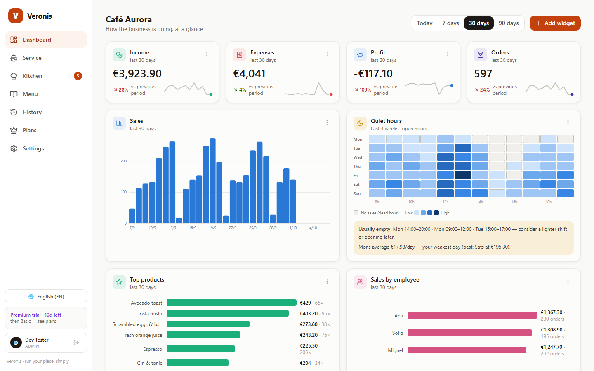
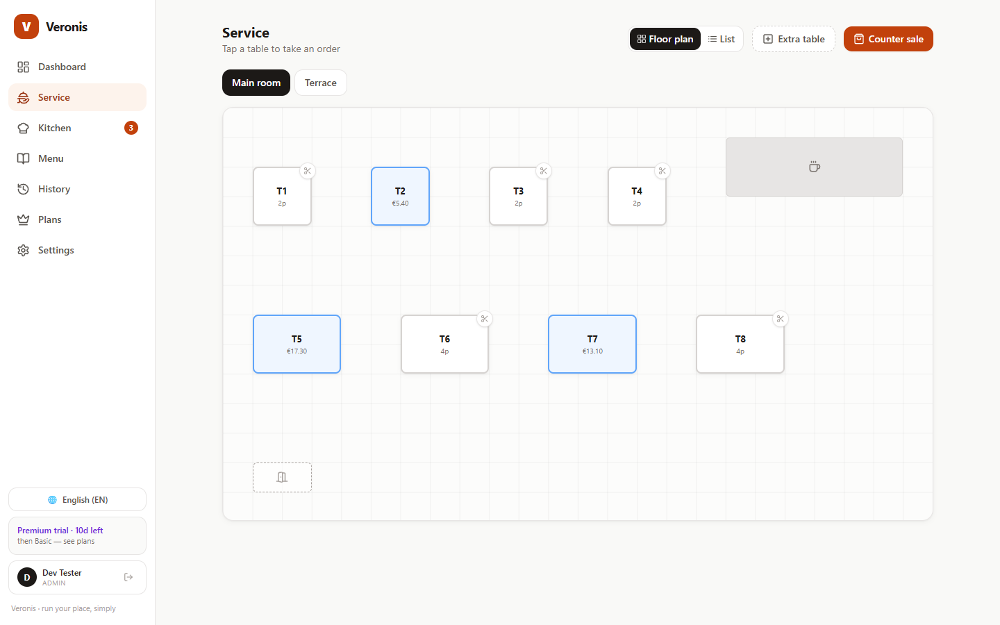
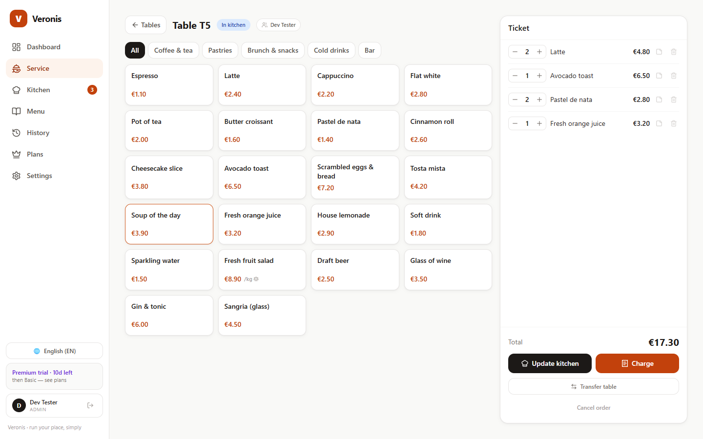
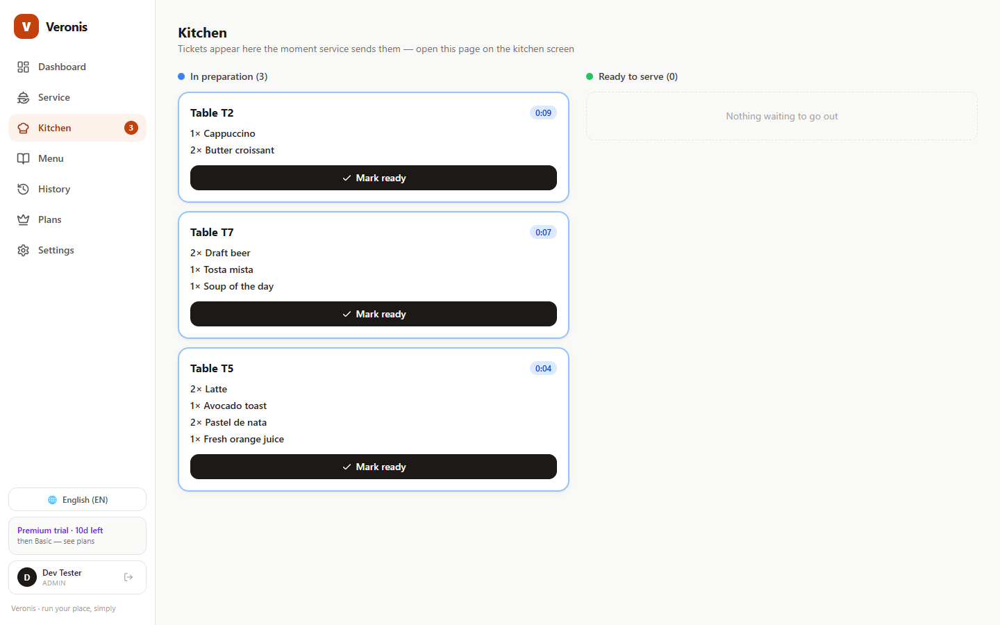
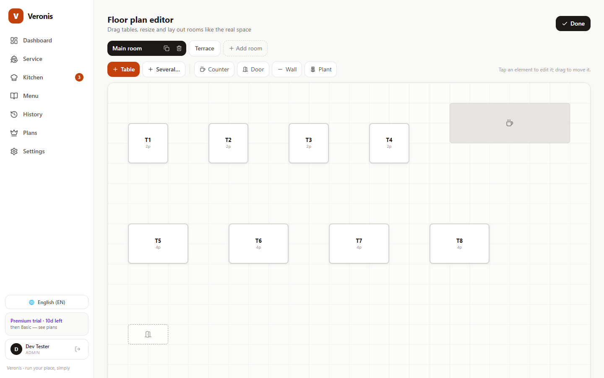

<div align="center">


# Veronis

**Run your place, simply.**

A lightweight point-of-sale and analytics app for small hospitality businesses —
cafés, pastry shops, bars. The simple, fully-customisable alternative to heavyweight
ERP suites: no training manual needed.




</div>

## Why Veronis

Most POS systems tell you what you sold. Veronis also tells you **when nobody came** —
the *Quiet hours* heatmap highlights the hours and days with no clients, so you know
when to open later, close earlier or run a lighter shift.

## Features

|  |  |
|---|---|
| **Dashboard** — a grid of widgets you compose: income, expenses, profit, orders, average ticket, sales per day, top products, category mix, payment split, sales by employee and **Quiet hours**. Recolour, resize, reorder or remove any widget. |  |
| **Service** — a live floor plan of your rooms. Tap a table → tap products → **send to the kitchen** → **charge** with a printable bill. Extra tables, table splitting, table transfers and counter/takeaway sales. |  |
| **Ticket** — quantities, notes and totals at a glance; update the kitchen as the order grows. |  |
| **Kitchen** — a live ticket queue with elapsed-time badges. Open it on a second screen; it syncs automatically. |  |
| **Floor plan editor** — drag and resize tables, counters, doors, walls and plants to match the real space. |  |

And also:

- **Menu** — categories, products, prices, on-sale toggles.
- **History** — sales grouped by day plus a simple expense ledger.
- **Grocery mode** — sell per item or by weight (€/kg) with barcodes. USB keyboard-wedge
  scanners work out of the box, including weight-embedded labels from label scales.
- **Team & roles** — admins manage employees; every order records who served it.
- **Bilingual** — Portuguese and English, switchable at any time.
- **Backups** — one-click versioned JSON export/import, and a crash screen that can
  always rescue the data.

## Quick start

Requires **Node.js 18+**.

```bash
git clone https://github.com/ops4you/Veronis-public.git veronis
cd veronis
npm install && npm run build      # build the front-end
cd server && npm install          # server deps (Express + SQLite)
node index.mjs                    # → http://localhost:8787
```

Open <http://localhost:8787> and click **Create business** to register the admin
account. A demo business with ~12 weeks of realistic sales is loaded, so every chart
has something to say on first launch.

### Development

```bash
npm run dev        # front-end with hot reload → http://localhost:5173 (proxies /api to :8787)
npm test           # Vitest unit/integration suite
npm run app:build  # Windows installer (NSIS) → release/Veronis-Setup-<version>.exe
```

Run `node server/index.mjs` alongside `npm run dev` so the API is available.

## Two ways to run

| | **Web (multi-user)** | **Desktop (.exe)** |
|---|---|---|
| Accounts | Email + password, admin & employee roles | None — single user |
| Storage | SQLite on the server, IndexedDB cache in the browser | IndexedDB, fully offline |
| Best for | Several devices: tills, kitchen screen, owner's phone | A single machine or a quick showcase |

The desktop app is a hardened Electron shell built from the same codebase; the mode is
detected automatically. It is not yet code-signed, so SmartScreen will ask for
*More info → Run anyway*.

## Configuration (web server)

| Variable | Purpose |
|---|---|
| `PORT` | HTTP port (default `8787`) |
| `NODE_ENV` | Set to `production` behind a TLS reverse proxy |
| `APP_URL` | Public URL used in email links |
| `SMTP_HOST`, `SMTP_PORT`, `SMTP_USER`, `SMTP_PASS` *(or `SMTP_URL`)* | Outgoing email |
| `MAIL_FROM` | Sender address |

Without SMTP, emails (confirmations, invites, password resets) are written to
`server/data/outbox/` so every flow works in development. Sample `systemd`, Caddy and
backup configs live in [`deploy/`](deploy/) — a €5 VPS is plenty.

## Security

See [SECURITY.md](SECURITY.md): sandboxed renderer, strict CSP, zero runtime network
calls in the desktop app, denied permissions, bcrypt-hashed passwords, httpOnly session
cookies and audit-clean runtime dependencies.

## Stack

Vite 5 · React 18 · TypeScript · Tailwind CSS 3 · Zustand · React Router · Lucide icons ·
hand-rolled SVG charts · Express · better-sqlite3 · Electron.

## Roadmap

- Dark mode and drag-and-drop widget reordering
- CSV export and printable daily summaries
- Shift reports
- Licence server for paid plans
